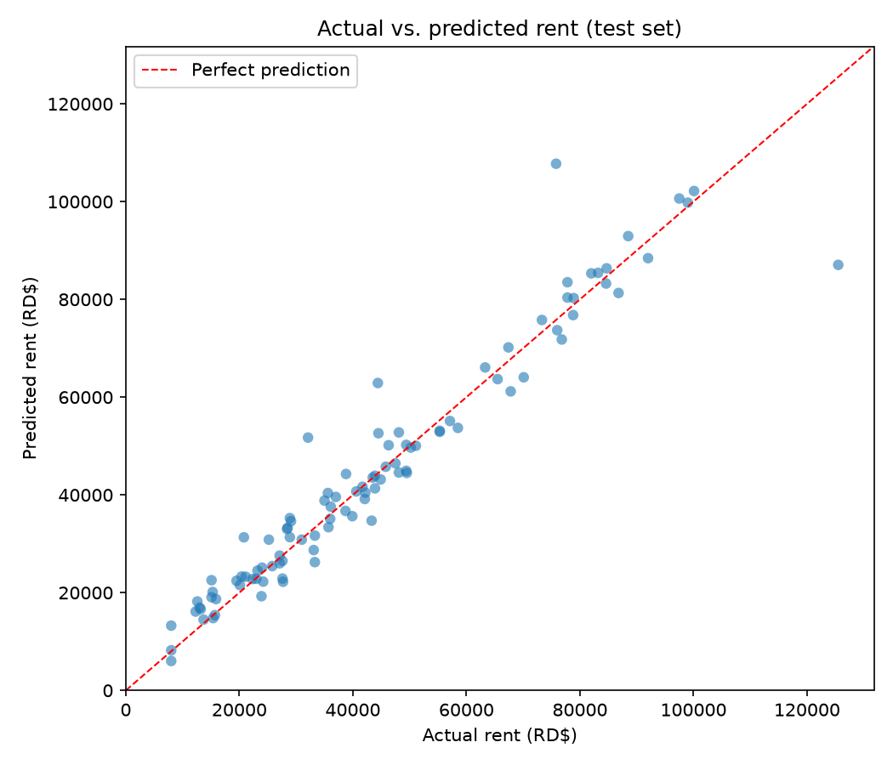
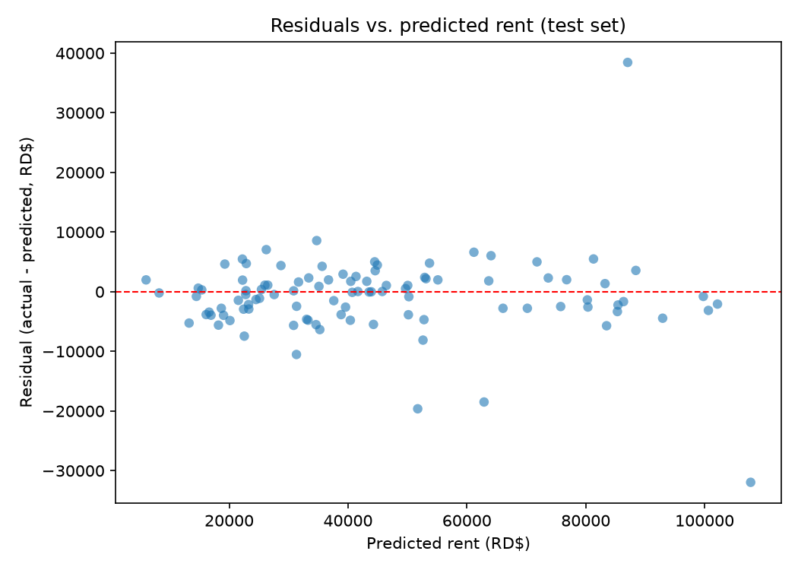

# Rental Price Estimator — Santo Domingo, DR

A linear regression model that estimates monthly rental prices for
properties in Santo Domingo, Dominican Republic, served through a
Streamlit web app aimed at local real estate agents (UI in Spanish).

**Live demo:** https://rental-price-estimator-sd.streamlit.app

AI Portfolio project 1 of 7. Goal: master linear regression end to end
— data, training pipeline, evaluation, and a deployable public demo —
on a problem with a real monetization path (freemium pricing tool for
real estate agencies).

## How it works

```
python generate_data.py   ->  data/rentals_sd.csv
python train.py           ->  models/rental_model.pkl + models/metrics.json + reports/*.png
streamlit run app.py      ->  interactive estimator (Spanish UI)
```

Three decoupled stages that communicate only through files. The CSV
schema (`sector, area_m2, bedrooms, bathrooms, parking_spots,
furnished, age_years, price_dop`) is the contract of the project:
swapping the synthetic data for real scraped listings only requires
producing a CSV with the same columns and re-running `train.py` —
neither the training script nor the app changes.

The current dataset is synthetic: 500 listings across 10 sectors in
three market tiers (premium: Piantini, Naco, Serrallés; mid: Bella
Vista, Arroyo Hondo, Los Prados, Gazcue; popular: Santo Domingo Este,
Villa Mella, Los Alcarrizos), generated as a linear combination of
features plus a per-sector location premium, Gaussian noise, and ~5%
deliberate outliers to simulate off-market listings. Seeded with
`random_state=42` for full reproducibility.

## Model

A single scikit-learn `Pipeline`:

- `ColumnTransformer`
  - `OneHotEncoder` for `sector` (nominal category — each sector learns
    its own price premium)
  - `StandardScaler` for the six numeric features (does not change the
    predictions of a linear model, but makes coefficients comparable to
    each other)
- `LinearRegression`

Preprocessing lives inside the pipeline, so it is fitted only on the
training split (no data leakage) and ships inside the serialized
`.pkl`: the app feeds raw feature rows and the pipeline handles the
rest. Split: 80/20, `random_state=42`.

### Metrics (20% hold-out test set)

| Metric | Value | Meaning |
| ------ | ----- | ------- |
| MAE | RD$ 3,983 | Average estimation error |
| RMSE | RD$ 6,749 | Typical error, weighting big misses; shown in the app as the confidence range |
| R² | 0.928 | The model explains 93% of the variation in rents |

Diagnostic plots are saved by `train.py`:





## Installation and local run

Requires Python 3.10+.

```
python -m venv .venv
.venv\Scripts\activate        # Windows (Linux/macOS: source .venv/bin/activate)
pip install -r requirements.txt

python generate_data.py
python train.py
streamlit run app.py
```

`models/` and `data/` are committed on purpose: the trained model,
`metrics.json` and the CSV must be present at runtime for the cloud
deploy to work without a training step.

## Deploy on Streamlit Cloud (free)

1. Push this repository to GitHub.
2. Go to https://share.streamlit.io and sign in with GitHub.
3. Click "Create app" > "Deploy a public app from GitHub".
4. Select this repository, branch `main`, main file `app.py`.
5. Deploy. Dependencies install automatically from `requirements.txt`,
   and the app loads the committed model — no extra configuration.

## Roadmap

- Replace synthetic data with real scraped listings (Corotos,
  SuperCasas) using the same CSV schema.
- Add features with pricing power: exact location, building amenities,
  floor level, years since remodeling.
- Compare against regularized linear models (Ridge, Lasso) and
  tree-based models once real data introduces non-linearities.
- Per-agency mode: retrain on an agency's own closed deals for private,
  calibrated estimates (monetization path).

## Disclaimer

The app shows: "Estimación orientativa, no constituye tasación
oficial" — estimates are indicative and do not constitute an official
appraisal. Current figures are calibrated on synthetic data and are
for demonstration purposes.
